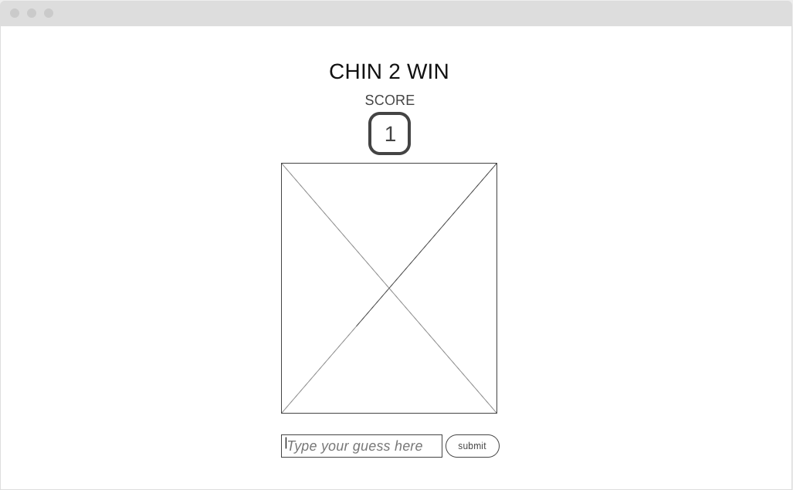
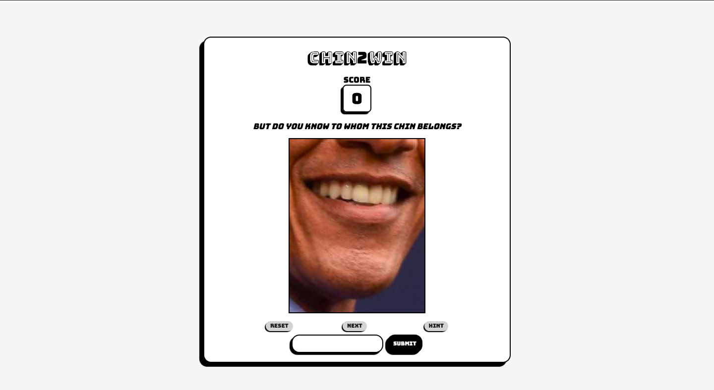
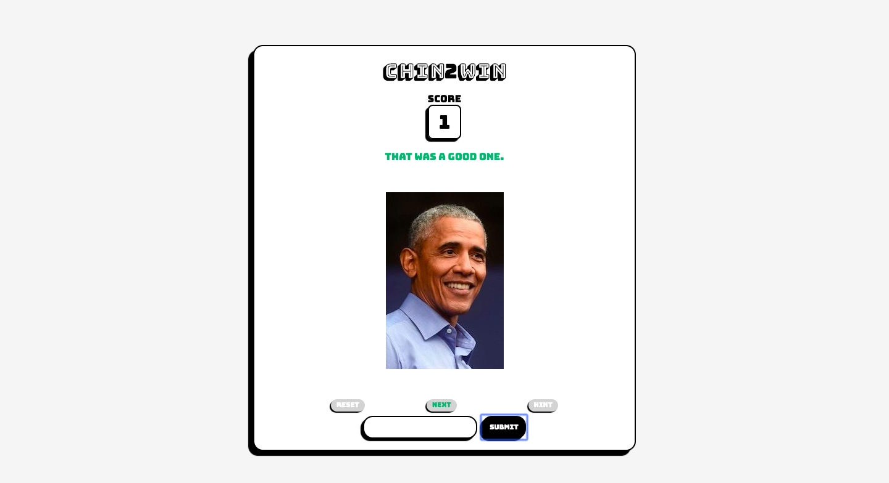
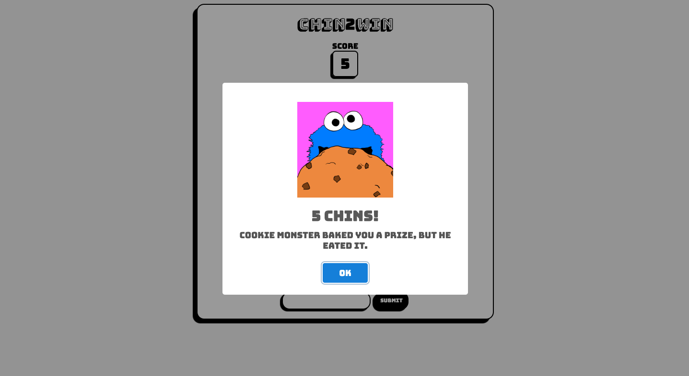
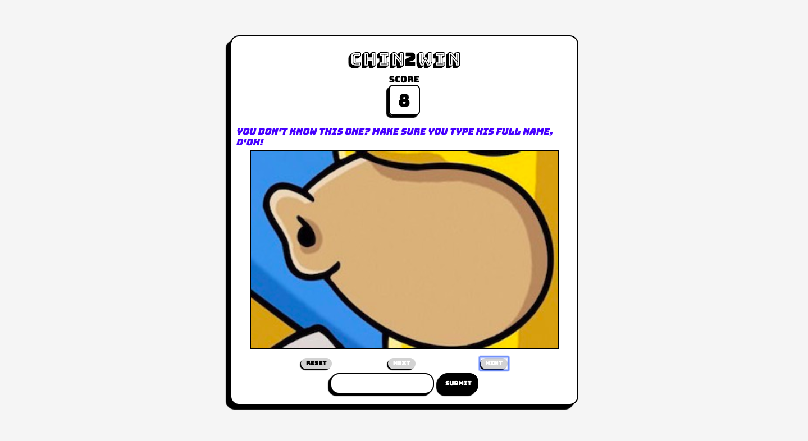
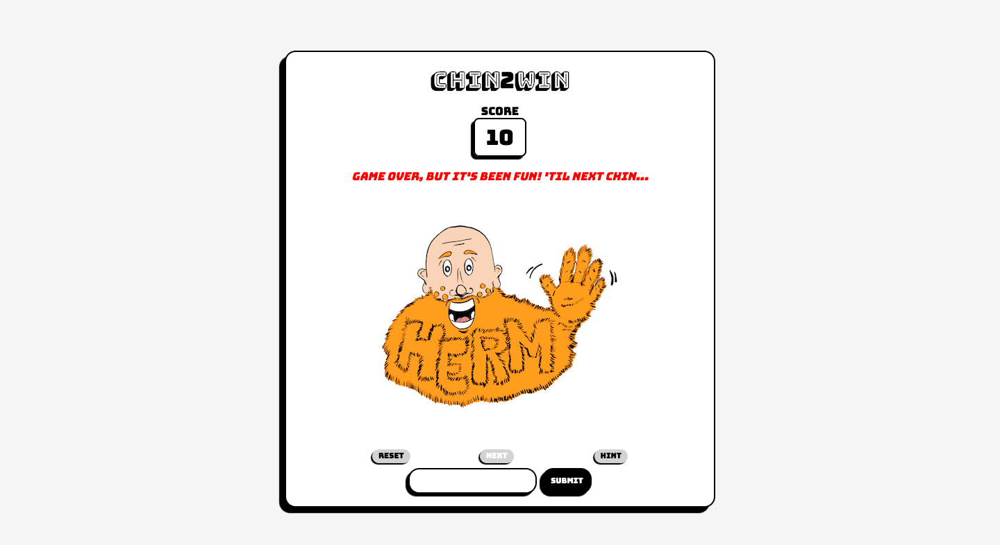

#Chin2Win

###Objective  
Chin2Win is a fun game to play for anyone who would like to test their celebrity chin knowledge amongst friends. Or perhaps one would like to just prove it to oneself.  

How to play:  
For each turn, an image of a public figure's chin will be displayed. Player types out their best guess of the name of the celebrity whose chin is pictured.

How to win:  
Guess 20 chins correctly!

Tips:  
- Spelling counts  
- Casing does not matter  
- Utilize hints (1 per chin)   
- Most answers are full names

###Technology Used
HTML, CSS, JavaScript, Node

###Wireframe and Screenshots

###Play Game  
<a href="https://fcancio.github.io/chin2win/">https://fcancio.github.io/chin2win/</a> 

###User stories
As a user, I want a fun, simple, and unique game that I can play by myself or with friends on the go, or at a social event.  
As a user, I want to be able to see a clear/high quality image of a chin so for guessing correctly.  
As a user, I need an input box to type out my guess  
As a user, I need a way to submit my guess.  
As a user, I need an alert or message to know whether or not my answer is correct.  
As a user, I would like a way to see my score, so I know how close I am to winning.  

###Features list:
- chin and face images
- user input
- score
- milestone alerts  

###Pseudocode:

1. [x] Chin image and player score should initialize upon loading the page.  
    - [x] create a chins array that holds chin objects that have properties chinImg, fullImg, answer.  
    - [x] upon render, an image pulled from the chins array will display on the page  
    - [x] create a player score that increments when player gets a correct answer  
2. [x] User should be able to type guess into input box and press submit.  
3. [x] User's input should be compared to the image variable/assignment.  
4. [x] If user input equals image variable:   
   - [x] user is alerted that they have guessed correctly  
   - [x] run render()  
        - [x] adds point to score  
        - [x] displays new chin image   
5. [x] If user input does not equal image variable  
   - [x] user is alerted that they should guess again   
6. [x] Add reset button that calls init.     

###Next Steps and stretch goals:
1. [x] Full face image shown when chin guessed correcly
2. [x] Various display messages based on correct or incorrect guesses
	- [x] create message arrays for different conditions
	- [x] display/return random idx within correct message array
        - [x] reset to default message at render
    - [x] All-chins-guessed/gameover feature
        [x] display 'Herm' image and 'Herm-approved' message
3. [x] Milestone messages at 5, 10, 15 chins
	- changing backdrop based on milstone reached
4. [x] Hints  
	- [x] create hint properties within chins array
	- [x] clickevent on 'hint button' will print a hint
        - hint becomes accessible if answer is incorrect
        - one additional hint becomes available for each additional incorrect guess
5. [x] Game Over result  
	- [x] count number of incorrect inputs
	- [x] if number of incorrect inputs == 5, game is over  
6. Display number of wrong inputs made
	- fix conditional logic for wrong inputs counted
7. Add additional alternate names for answers
8. Incorrect guess passes
9. Trade incorrect guess pass for clues
10. Timer
11. Multiplayer/How fast?: Each player takes turns correctly typing the name of a celebrity whose chin is pictured. A player accumulates  time for every second taken to answer correctly, with a time limit of 60 seconds (1 minute) for each turn. If a player is unable to correctly guess the name of the celebrity within the time limit, 120 seconds (2 minutes) will be added to their cumulative time.